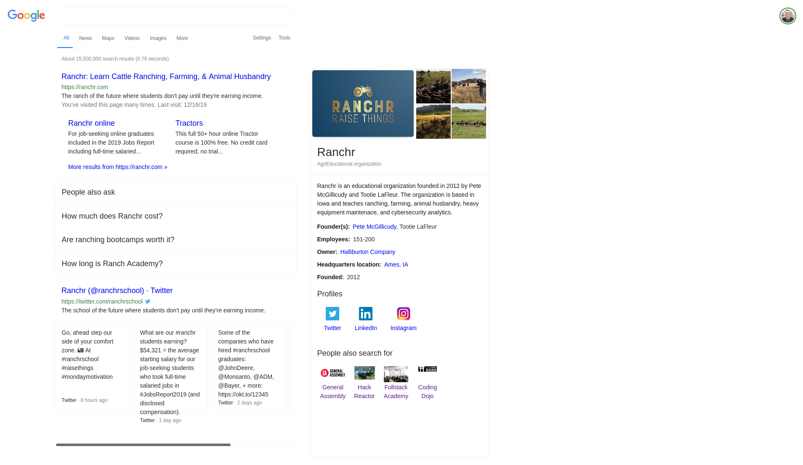

# Google Search Results

Your task is to use Angular components to recreate this:

The final HTML is loaded into the `src/app/app.component.html` already and the styles are already applied. Your task is to:

* Break both of those up into appropriately-sized components
* Replace all of the hard-coded data with data from the `data` property that's been loaded into the app component

Some notes:

* Your solution does not need to be adaptive or responsive. All styles are already complete and will function the same as long as the element hierarchy and class and ID names are maintained.
* Some of the raw HTML attributes (like `class`) will need to be turned into valid JSX
* Some properties need to be interpreted. For example:
  * Most dates will need to be put in the correct format. A package such as `dayjs` or `date-fns` is recommended.
  * Some numbers will need commas added
  * Some strings need to be truncated and ellipsis added
  * The visit frequency counts need to be interpreted
  * Some link URLs will need to be constructed
